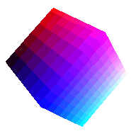

# PNG Third Edition, Explained

## Authors:

- Chris Lilley

## Participate

- [Issue tracker](https://github.com/w3c/PNG-spec/issues)

## Table of Contents [if the explainer is longer than one printed page]

<!-- START doctoc generated TOC please keep comment here to allow auto update -->
<!-- END doctoc generated TOC please keep comment here to allow auto update -->

## Introduction

PNG is a very widely deployed, lossless, raster image format
for RGB and grayscale images,
with or without an alpha channel.

The [First Edition](https://www.w3.org/TR/REC-png-961001) was published as W3C Recommendation in 1996
and the [Second Edition](https://www.w3.org/TR/2003/REC-PNG-20031110/),
which is also published as ISO/IEC 15948:2003,
in 2003.

This explainer covers solely changes for the 
[Third Edition](https://www.w3.org/TR/png-3/),
currently under development. The Third Edition adds widely-requested features
and folds in errata reported since the
Second Edition.

## Motivating Use Cases

For **short animations** currently better handled by Animated GIF than by video files,
there is a need for an animation format which avoids the **limitations of GIF**
(256 colors, only on-off transparency)
and draws on the **strengths of PNG**
(24 or 48bit truecolor, full alpha transparency
for halo-less display over any background).

 

PNG Second Edition was limited to
Standard Dynamic Range (SDR) imagery.
With the growing use of **High Dynamic Range (HDR)**
there was a need to extend PNG to support HDR images
during **content creation workflow**
for **display** on HDR or SDR displays.

## Non-goals

**Backwards compatibility** with the enormous installed base of PNG images
is considered paramount,
so non-backwards-compatible changes
such as a better compression method,
are [out of scope in the charter](https://www.w3.org/Graphics/PNG/png-2021.html#section-out-of-scope).

## User research

### Animated PNG

Between 1999 and 2001, a fully-featured animated format called
Multiple-image Network Graphics ([MNG](http://www.libpng.org/pub/mng/spec/)) was developed.
It could contain animations, slide shows, or complex still frames,
comprised of multiple PNG (including delta images) or JNG (JPEG in a PNG-like container) 
single-image datastreams.

This was briefly implemented in Firefox, but was then 
[removed in 2004](https://bugzilla.mozilla.org/show_bug.cgi?id=195280) 
due to complexity,
lack of use,
and lack of maintenance for the library:

> (The) mng decoder module is roughly the same size as _all the other image decoders_ and libpr0n logic combined.

During 2004 and 2005, Vladimir Vukicevic and Stuart Parmenter (then both with Mozilla)
created and refined **Animated PNG (APNG)**, an addition to PNG (rather than an entirely separate format, like MNG)
which combined the existing benefits of PNG
and the limited, but demonstrably sufficient,
animation features of GIF.
**Fallback** to a non-animated PNG 
(which could be, but need not be, the first frame of the animation)
was a feature.

Firefox 3 added APNG support in 2007.

The PNG development group, after much discussion, **rejected APNG in 2007**,
mostly on the grounds that it was not MNG and that PNG should remain a static format.
Two attempts to restart the discussion in the following years failed.

APNG was documented [on the Mozilla wiki](https://wiki.mozilla.org/APNG_Specification)
and browsers and other tools added a variety of patches to their own versions of libpng,
to support APNG.

APNG started to be [**added to other platforms**](https://caniuse.com/apng):
to Opera 9 in 2009,
Safari 8 in 2014,
to iOS in 2016,
to [Chrome 59](https://chromestatus.com/feature/6691520493125632) in 2017
and to Edge 79 in 2019.
Authoring support also improved over time.

## APNG

The PNG working group was chartered in 2021
to maintain and extend the PNG specification;
in particular, to add the widely adopted APNG extensions to the **core PNG specification**.
This has now been done:

 - [ APNG: frame-based animation](https://www.w3.org/TR/png-3/#apng-frame-based-animation)
    - ['acTL' Animation Control Chunk](https://www.w3.org/TR/png-3/#acTL-chunk)
    - ['fcTL' Frame Control Chunk](https://www.w3.org/TR/png-3/#fcTL-chunk)
    - ['fdAT' Frame Data Chunk](https://www.w3.org/TR/png-3/#fdAT-chunk)

These are precisely the same as the Mozilla documentation,
bringing the PNG specification into line with a
decade of deployed content and implementations.

## [API 2]

[etc.]

## Key scenarios

[If there are a suite of interacting APIs, show how they work together to solve the key scenarios described.]

### Scenario 1

[Description of the end-user scenario]

```js
// Sample code demonstrating how to use these APIs to address that scenario.
```

### Scenario 2

[etc.]

## Detailed design discussion

### [Tricky design choice #1]

[Talk through the tradeoffs in coming to the specific design point you want to make.]

```js
// Illustrated with example code.
```

[This may be an open question,
in which case you should link to any active discussion threads.]

### [Tricky design choice 2]

[etc.]

## Considered alternatives

[This should include as many alternatives as you can,
from high level architectural decisions down to alternative naming choices.]

### [Alternative 1]

[Describe an alternative which was considered,
and why you decided against it.]

### [Alternative 2]

[etc.]

## Stakeholder Feedback / Opposition

[Implementors and other stakeholders may already have publicly stated positions on this work. If you can, list them here with links to evidence as appropriate.]

- [Implementor A] : Positive
- [Stakeholder B] : No signals
- [Implementor C] : Negative

[If appropriate, explain the reasons given by other implementors for their concerns.]

## References & acknowledgements

[Your design will change and be informed by many people; acknowledge them in an ongoing way! It helps build community and, as we only get by through the contributions of many, is only fair.]

[Unless you have a specific reason not to, these should be in alphabetical order.]

Many thanks for valuable feedback and advice from:

- [Person 1]
- [Person 2]
- [etc.]
